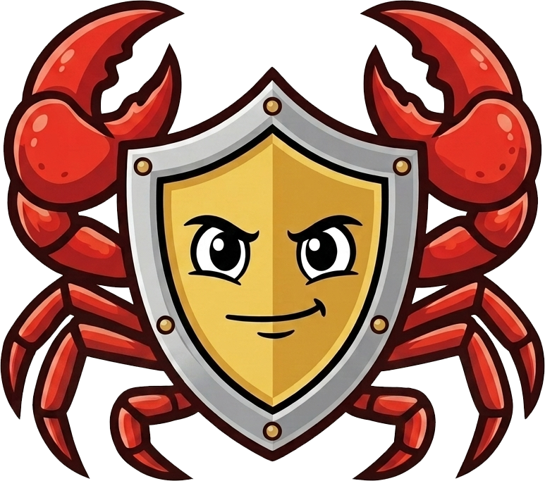
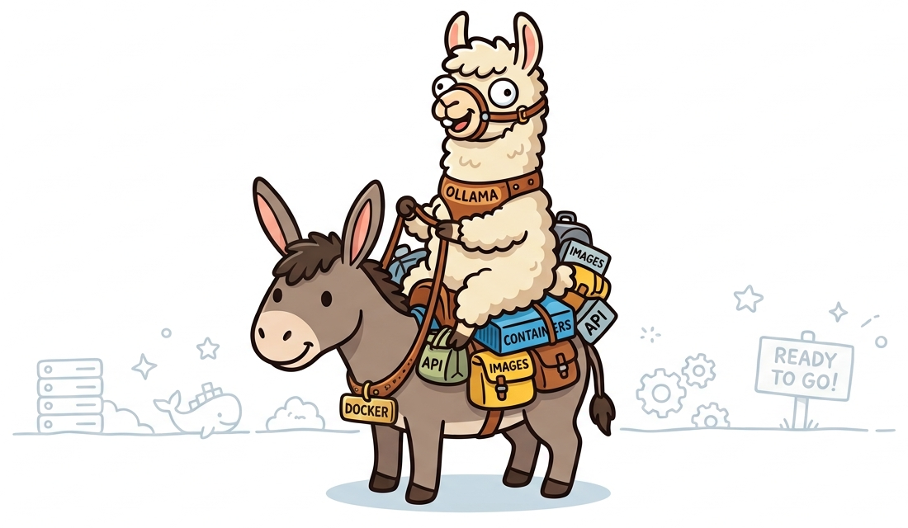

  
  <h1>Up Next: Project kkokke</h1>
  <h3>Lightweight Security & Vulnerability Scanner</h3>

  🦀 꽃게 [kko-khe]: 취약점을 찝게발로 깍 찝어드립니다. 🦀 
  ✂️ Pinching the vulnerability right where it hurts. ✂️

  <h3>NOW STEAMING 🦀♨️, COMING SOON!</h3>

---

  
  
The next-next project <b>docker-donkey-harness-ollama-llama</b> is already waiting in the queue.. 🫏🦙

