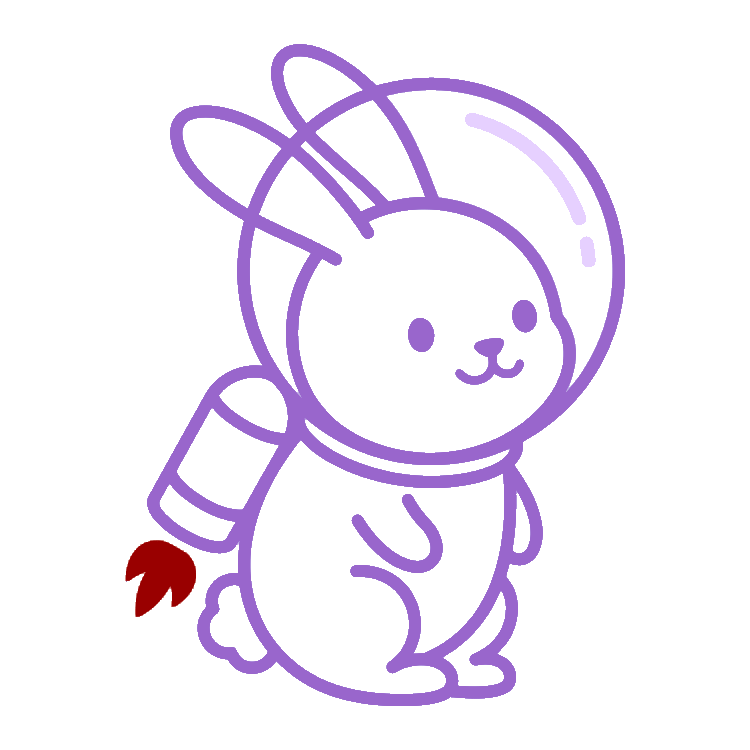
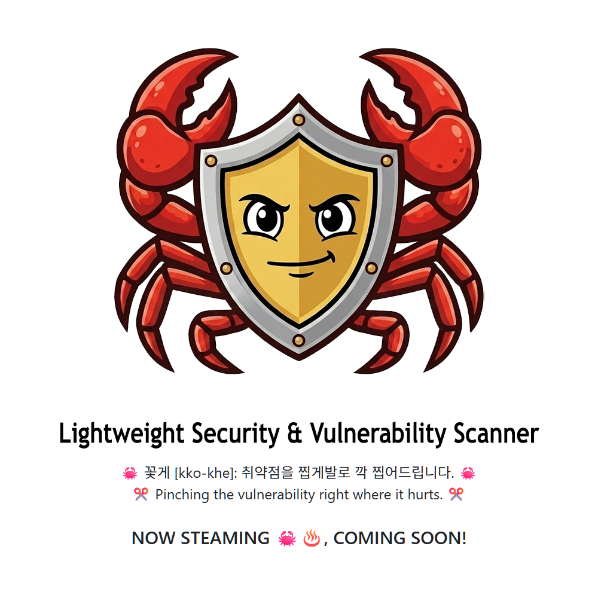
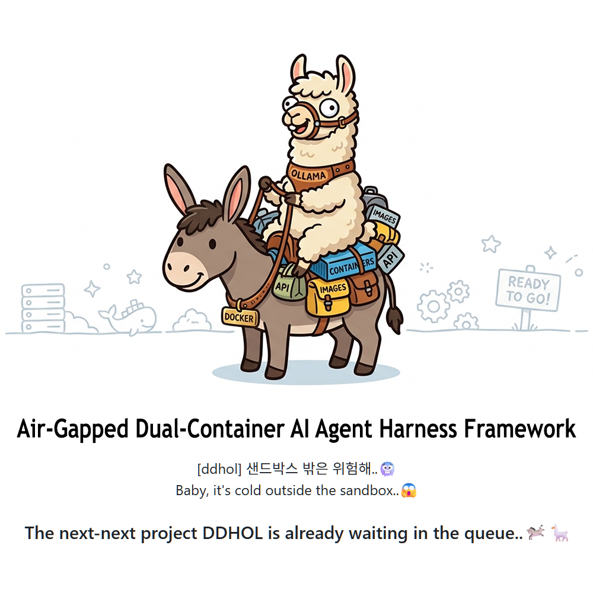

  
  <h3>I'm Karyx💫 (Irene Haan) • AI Engineer (ex-SW Engineer)</h3>
  

 

> 이 계정의 모든 저장소(repo)는 Fork 없이 100% 직접 기획하고 개발한 프로젝트들입니다. 
All repositories here are original projects, planned and developed by me. Zero forks.

---

  <h3>🚀 Projects & AI Competitions 🏆</h3>

<table width="100%">
  <!-- Row 1 -->
  <tr>
    <td width="50%" align="center">
      
      <h3><a href="https://github.com/karmakaryx/follow-the-orbit-rabbit">1. [MLOps] Follow The Orbit Rabbit</a></h3>
      
Space-Track TLE 수집 → 학습 → 서빙 → 알림 end-to-end 파이프라인

      

        
        
        
        
        
      

    </td>
    <td width="50%" align="center">
      
      <h3><a href="https://github.com/karmakaryx/kattpaw">2. [AI Agent] KattPaw</a></h3>
      
AI 대화·코드 변경·실행 로그를 스냅샷으로 묶어 버전 관리하는 브라우저 기반 AI 에이전트 IDE

      

        
        
        
        
        
      

    </td>
  </tr>
  <!-- Row 2 -->
  <tr>
    <td width="50%" align="center">
      
      <h3><a href="https://github.com/karmakaryx/ocr-receipt-text-detection">3. [OCR] Receipt Text Detection</a></h3>
      
AI 대회: 영수증 글자 검출 🏆 1st Place (Solo)

      

        
        
         
        
        
        
        
        
      

    </td>
    <td width="50%" align="center">
      
      <h3><a href="https://github.com/karmakaryx/cv-document-type-classification">4. [CV] Document Type Classification</a></h3>
      
AI 대회: 문서 타입 분류 🏆 1st Place (Team Lead)

      

        
        
         
        
        
        
        
      

    </td>
  </tr>
  <!-- Row 3 -->
  <tr>
    <td width="50%" align="center">
      
      <h3><a href="https://github.com/karmakaryx/nlp-dialogue-summarization">5. [NLP] Dialogue Summarization</a></h3>
      
AI 대회: 일상 대화 요약 🏆 1st Place (Team Lead)

      

        
        
        
         
        
        
        
        
      

    </td>
    <td width="50%" align="center">
      
      <h3><a href="https://github.com/karmakaryx/ir-science-rag-pipeline">6. [IR] Science Rag Pipeline</a></h3>
      
AI 대회: 과학 지식 질의응답 시스템 🥈 2nd Place (Solo)

      

        
        
        
        
         
        
        
        
        
      

    </td>
  </tr>
  <!-- Row 4 -->
  <tr>
    <td width="50%" align="center">
      
      <h3><a href="https://github.com/karmakaryx/rs-commerce-purchase-behavior-prediction">7. [RecSys] Commerce Purchase Prediction</a></h3>
      
AI 대회: 커머스 상품 구매 예측 🏆 1st Place (Solo)

      

        
        
        
         
        
        
        
        
        
      

    </td>
    <td width="50%" align="center">
      
      <h3><a href="https://github.com/karmakaryx/ml-house-price-prediction">8. [ML] House Price Prediction</a></h3>
      
AI 대회: 아파트 실거래가 예측 🥈 2nd Place (Solo)

      

        
        
        
         
        
        
        
        
        
      

    </td>
  </tr>
  <!-- Row 5 -->
  <tr>
    <td width="50%" align="center" colspan="2"><b>Up Next</b></td>
  </tr>
  <tr>
    <td width="50%" align="center">
      
      <h3><a href="https://github.com/karmakaryx/kkokke">kkokke</a></h3>
      
경량 보안 & 취약점 스캐너 VS Code Extension (개발 중) 

    </td>
    <td width="50%" align="center">
      
      <h3><a href="https://github.com/karmakaryx/docker-donkey-harness-ollama-llama">docker-donkey-harness-ollama-llama</a></h3>
      
폐쇄망 이중 컨테이너 구조 AI 에이전트 실행 제어 프레임워크 (개발 중) 

    </td>
  </tr>
</table>

## 🛠️ Skills & Tools
<h3>[💻 Languages & Markup]</h3>

  
  
  
  
  
  
  
  
  
  
  
  
  
  
  
  
  

<h3>[🎨 Frontend & UI/UX]</h3>

  
  
  
  
  
  
  
  
  
  
  

<h3>[⚙️ Backend & Frameworks]</h3>

  
  
  
  
  
  
  
  
  
  

<h3>[🗄️ Database & Search]</h3>

  
  
  
  
  
  
  
  
  
  
  
  

<h3>[🤖 AI & Machine Learning]</h3>

  
  
  
  
  
  
  
  
  
  
  
  
  
  
  
  
  

<h3>[☁️ DevOps, Cloud & Tools]</h3>

  
  
  
  
  
  
  
  
  
  
  
  
  
  
  
  
  
  
  
  
  
  
  

<h3>[📱 Mobile & Embedded]</h3>

  
  
  
  
  
  

<h3>[🏢 Enterprise & SI Solutions (Batch, I/F, etc.)]</h3>

  
  
  
  
  
  
  
  
  
  
  
  
  
  

<h3>[🎬 Design & Multimedia]</h3>

  
  
  
  
  
  
  

